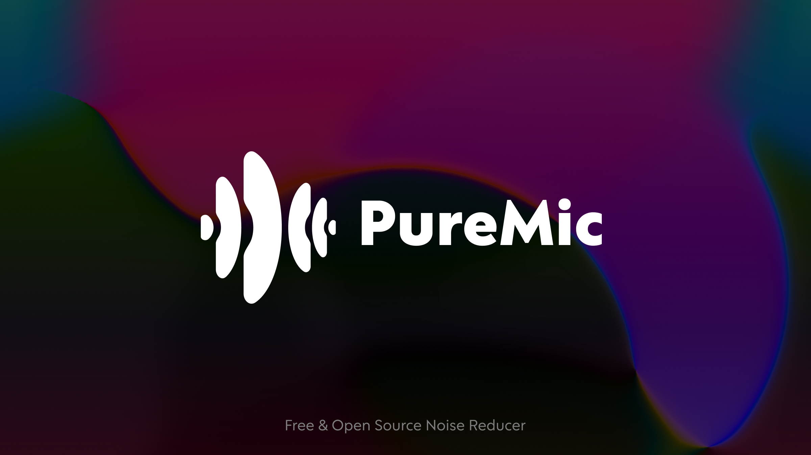

<p align="center">
  
</p>

# PureMic Noise Reducer

Real-time AI-powered noise cancellation and voice isolation for macOS and Windows. PureMic sits between your microphone and your applications, removing background noise in real time so your voice comes through crystal clear in calls, streams, and recordings.

---

## Table of Contents

- [Features](#features)
- [Architecture](#architecture)
- [Tech Stack](#tech-stack)
- [Prerequisites](#prerequisites)
- [Local Setup](#local-setup)
- [Project Structure](#project-structure)
- [Contributing](#contributing)
- [License](#license)

---

## Features

- **AI Noise Suppression** — RNNoise-based deep learning model removes keyboard clicks, fans, traffic, and ambient noise in real time.
- **3-Band Equalizer** — Professional Bass, Mid, and Treble controls with biquad filters to shape your voice after denoising.
- **Hard Reduce Mode** — Aggressive VAD-based noise gate for extremely noisy environments. Silences everything below a voice activity threshold.
- **Low-Latency Monitoring** — Hear your processed voice in real time through any output device with minimal delay.
- **Virtual Audio Driver** — Installs a virtual microphone (PureMicDriver on macOS, VB-Cable on Windows) so other apps like Discord, Zoom, and OBS receive the cleaned audio automatically.
- **Cross-Platform** — Native performance on both macOS (Core Audio / HAL plugin) and Windows (WASAPI / VB-Cable).
- **System Tray Integration** — Runs silently in the background. Left-click to toggle the window, right-click to quit.
- **Input/Output Gain Control** — Fine-tune microphone sensitivity and monitoring volume independently.
- **Device Hot-Swap** — Refresh and switch between audio devices without restarting the application.

---

## Architecture

```
Microphone Input
      |
      v
  [Input Gain] --> [Resample to 48kHz] --> [RNNoise Denoiser]
                                                  |
                                           [Hard Reduce Gate]
                                                  |
                                            [3-Band EQ]
                                                  |
                          +-----------------------+-----------------------+
                          |                                               |
                    [Virtual Device]                              [Monitor Output]
                   (for other apps)                              (for user to hear)
```

---

## Tech Stack

### Frontend

| Technology | Purpose |
|---|---|
| React 18 | UI framework |
| TypeScript | Type-safe development |
| Vite | Build tool and dev server |
| Tailwind CSS 3 | Utility-first styling |
| Radix UI | Accessible primitives (Select, Slider, Switch, Tooltip) |
| Lucide React | Icon library |
| Geist Sans | Typography |

### Backend (Rust / Tauri)

| Technology | Purpose |
|---|---|
| Tauri 2 | Desktop application framework |
| cpal | Cross-platform audio I/O (Core Audio, WASAPI) |
| nnnoiseless | Pure Rust RNNoise port for noise suppression |
| ringbuf | Lock-free ring buffer for audio streaming |
| rubato | Sample rate conversion |
| tokio | Async runtime |
| tracing | Structured logging |

### Audio Driver

| Component | Platform | Description |
|---|---|---|
| PureMicDriver | macOS | Custom Core Audio HAL plugin (C) installed to `/Library/Audio/Plug-Ins/HAL/` |
| VB-Cable | Windows | Virtual audio cable bundled with the installer |

---

## Prerequisites

| Requirement | macOS | Windows |
|---|---|---|
| Rust toolchain | [rustup.rs](https://rustup.rs) | [rustup.rs](https://rustup.rs) |
| Node.js 18+ | `brew install node` | [nodejs.org](https://nodejs.org) |
| Xcode Command Line Tools | `xcode-select --install` | — |
| Visual Studio Build Tools | — | Required for Tauri on Windows |

---

## Local Setup

### macOS

1. **Clone the repository**

```bash
git clone https://github.com/cankaytaz/PureMic-Noise-Reducer.git
cd PureMic-Noise-Reducer
```

2. **Install frontend dependencies**

```bash
npm install
```

3. **Build the virtual audio driver**

```bash
cd driver
chmod +x build.sh
./build.sh
cd ..
```

4. **Run in development mode**

```bash
npm run tauri dev
```

The application window opens automatically. On first launch you will be prompted to install the virtual audio driver (requires administrator privileges).

5. **Build for production**

```bash
npm run tauri build
```

The compiled `.app` bundle will be in `src-tauri/target/release/bundle/`.

### Windows

1. **Clone the repository**

```bash
git clone https://github.com/cankaytaz/PureMic-Noise-Reducer.git
cd PureMic-Noise-Reducer
```

2. **Install frontend dependencies**

```bash
npm install
```

3. **Run in development mode**

```bash
npm run tauri dev
```

On Windows the VB-Cable virtual audio driver is bundled with the NSIS installer and installs automatically during setup. No manual driver build is required.

4. **Build the installer**

```bash
npm run tauri build
```

The NSIS installer will be in `src-tauri/target/release/bundle/nsis/`.

---

## Project Structure

```
PureMic-Noise-Reducer/
├── src/                        # React frontend
│   ├── components/             # UI components (EQPanel, SettingsModal, DriverSetup, …)
│   ├── hooks/                  # Custom hooks (useAudio, useMicrophones, useOutputDevices, …)
│   ├── lib/                    # Utilities, Tauri bridge, types
│   └── pages/                  # Main application page
├── src-tauri/                  # Rust backend
│   ├── src/
│   │   ├── audio/              # Audio pipeline, EQ, driver installer
│   │   ├── rnnoise/            # RNNoise denoiser wrapper
│   │   └── commands/           # Tauri command handlers
│   ├── icons/                  # App and tray icons
│   ├── nsis/                   # Windows installer hooks
│   └── assets/                 # Installer branding assets
└── driver/                     # macOS Core Audio HAL plugin (C source)
    └── windows/                # Windows VB-Cable installer
```

---

## Contributing

Contributions are welcome. Please read [CONTRIBUTING.md](CONTRIBUTING.md) for guidelines on branching, commit messages, code standards, and the pull request process.

---

## License

This project is licensed under the MIT License. See the [LICENSE](LICENSE) file for details.
